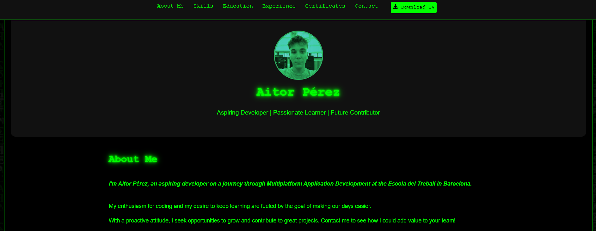

# Welcome to my portfolio 💻☕

## Here is a preview:



Welcome to my personal portfolio! This project showcases my skills, experience, and certifications with a unique **Matrix-inspired** design. The webpage includes various interactive animations, a typing effect for the headings, and a futuristic green-on-black aesthetic.

## Features ✨
- **Typing Animation:** The header text writes itself dynamically.
- **Matrix Background Effect:** A moving background with a cyberpunk touch.
- **Futuristic UI:** Styled using CSS animations and a neon green color scheme.
- **Responsive Design:** Fully optimized for desktop and mobile.

## Technologies Used 🛠️
- **HTML5**
- **CSS3 (Animations, Flexbox, Grid)**

## Installation ⚙️
1. Clone this repository:
   ```https
   git clone https://github.com/Tortillaa/portfolioMatrix.github.io
   ```
2. Open `index.html` in your browser.

---
### Author
Aitor Pérez López
📧 Contact: aitor.house@hotmail.com(mailto:aitor.house@hotmail.com)
